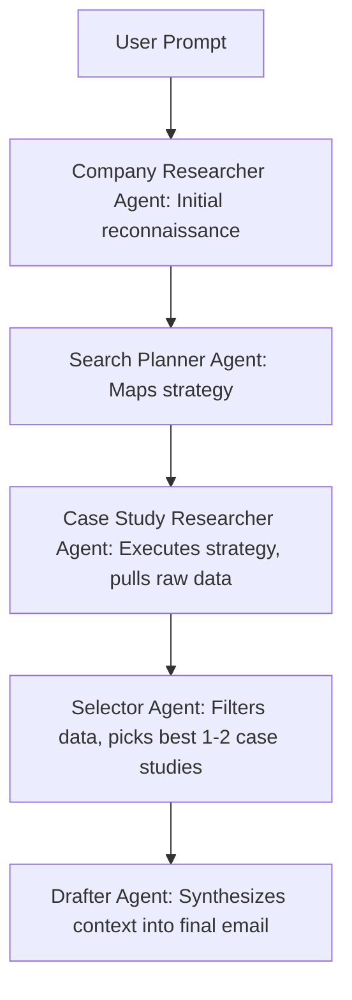
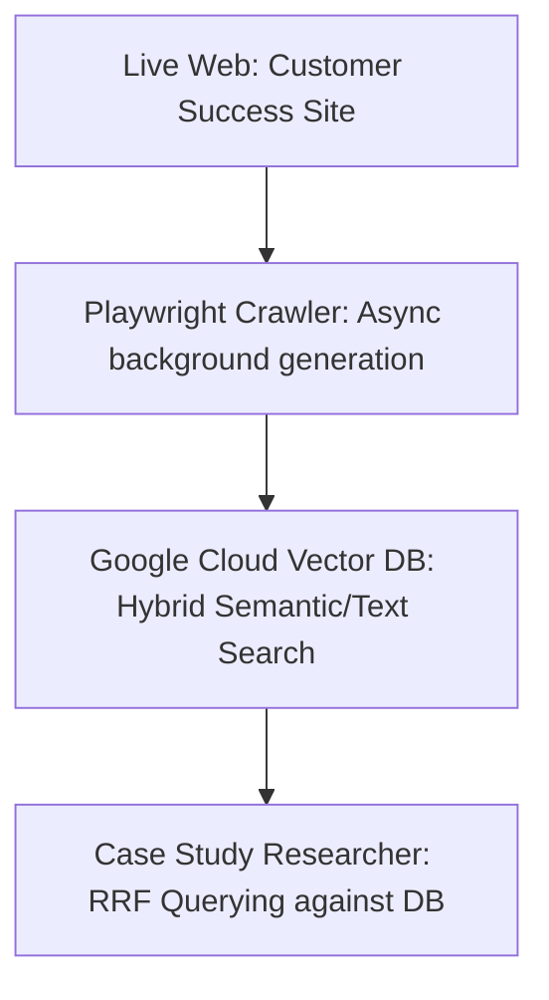

Building an AI agent that works beautifully on your local machine is easy. Building one that survives contact with reality—handling rate limits, avoiding infinite loops, and scaling beyond hardcoded data—is a completely different beast. This isn't just about elegant code; it's about avoiding runaway cloud bills, reputational damage from hallucinated outputs, and the sheer operational nightmare of a silent failure in production.

We see these fragile architectures every day. That’s why we launched the AI Agent Clinic. In our premiere episode, Luis Sala sat down with Jacob Badish to tear down "Titanium"—a promising but brittle sales research agent. Titanium's original job was to research a target company and draft a personalized outreach email. While the prototype ran, it was slow, relied on a monolithic Python script, and was limited to a hardcoded list of just 12 case studies.

Over the course of an hour, the team tore down and rebuilt the agent for production. Here are the core breakdowns, the fixes, and the engineering lessons from Episode 1.

### 1. Ditch the Monolith for Orchestrated Sub-Agents
**The Breakdown:** The original agent was running on a massive, linear `for` loop—a monolithic script. If one sub-task failed (an API timeout or hallucination), the entire process stalled out and failed silently.
**The Fix:** We ripped out the monolith and installed a distributed framework using Google’s Agent Development Kit (ADK). We created a `SequentialAgent` pipeline, splitting the workload into specialized nodes: a Company Researcher, Search Planner, Case Study Researcher, Selector, and an Email Drafter.
**The Lesson:** Separation of concerns. Specialized agents with narrow tasks run more reliably than a single LLM trying to execute a massive, multi-step prompt.

**Architecture: The Orchestrated Pipeline Swap**


### 2. Force Structured Outputs (via Pydantic)
**The Breakdown:** Originally, Titanium forced JSON outputs out of the model via extensive hard-coding straight inside the prompt string. It resulted in dirty code, fragile parsing, and wasted tokens describing the exact structure over and over again.
**The Fix:** When swapping to ADK, we eradicated schema formatting instructions out of the prompt. Instead, we injected native Pydantic objects directly as explicit schema definitions. ADK uses LLM function calling features dynamically under the hood to abstract the boilerplate and force adherence.

```python
# BEFORE: Prompt String Bloat
prompt = """
Give me the answer in this JSON format:
{
   "company": "Company Name",
   "pain_points": ["point1", "point2"]
}
"""

# AFTER: Pydantic Schema Injection in ADK
class CompanyIntel(BaseModel):
    company: str
    pain_points: list[str]
```

### 3. Replace Hardcoded State with a Dynamic RAG Pipeline
**The Breakdown:** Titanium’s context corpus was artificially tiny. It only knew about 12 hardcoded case studies written directly into the Python file. It couldn't scale or learn without a developer manually updating the code.
**The Fix:** We built a dynamic data intake system. An async crawler (Playwright) runs in the background to autonomously scrape Google Cloud's customer success website and batch them to Google Cloud Vector Search. Back in the pipeline, the Case Study Researcher runs a true Hybrid Search (combining Semantic & Exact Text searches via Reciprocal Rank Fusion) on the indexed corpus to fetch ideal case studies.
**The Lesson:** Hardcoding is fine for a prototype, but a production pipeline needs to refresh itself. True agentic value comes from giving agents the tools to autonomously fetch, scale, and query via Vector Search. Stop hardcoding your context limits.

**Architecture: The RAG Pipeline Intake**


### 4. Observability is Non-Negotiable
**The Breakdown:** When an LLM gets confused in a standard script, it’s a "black box." You know something failed, but you have no idea which component caused the break.
**The Fix:** We tapped into ADK’s first-class support for OpenTelemetry. Out of the box, ADK emits distributed traces for full execution flows, capturing model requests, tokens, and tool executions. We paired this OpenTelemetry backend with a tailored Server-Sent Events (SSE) streaming app, effectively designing a sleek live-telemetry dashboard for the user.
**The Lesson:** You cannot put an agent into production without live diagnostics. You need OpenTelemetry traces to resolve ground-truth disputes and debug individual component latencies.

### 5. Taming the Token Burn (Cost Optimization)
**The Breakdown:** Agentic loops are expensive. If an agent hits an error and continually retries a prompt without strict boundaries, it will burn through your token budget in minutes.
**The Fix:** By standardizing heavily on ADK's native orchestration, we inherited intrinsic cost optimizations automatically. The framework natively encompasses exponential backoffs, timeout boundaries, and configurable retry loops without writing custom logic into our native Python.
**The Lesson:** Always install circuit breakers. Let ADK or your orchestration framework handle graceful failures rather than writing complex try-catch retry loops natively.

> **Dive Deeper:**
> * 📺 **Watch Episode 1 live:** [YouTube Link]
> * 💻 **Fork the Titanium Repo:** [GitHub Link]
> 
> **Stuck in Prototype Purgatory?**
> Is your agent brittle, buggy, or hallucinating? Submit your architecture to agent-clinic@google.com and we might tear it down and fix it live on the next episode.
